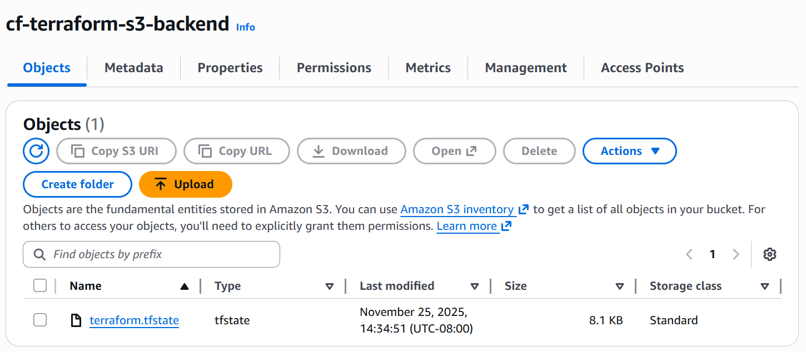
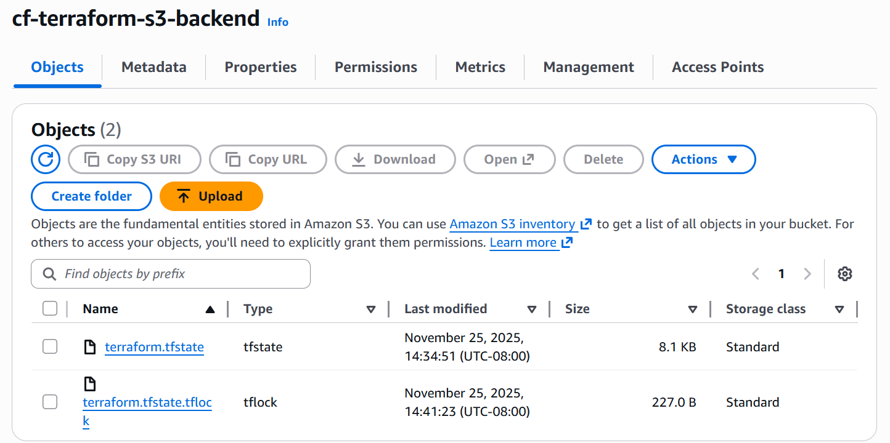

# terraform-s3-backend-lab

## 1. When is the state file created?

The state file is created the first time Terraform runs an operation that writes state, usually during the initial terraform apply. It stores the resources Terraform is managing.

## 2. When is the lock file present?

The lock file is present only while Terraform is actively running a command that needs to read or modify the state, such as apply, destroy, or refresh.

## 3. Is the lock file always in the bucket after it is created?

No. The lock file is temporary and is automatically removed when Terraform completes the operation and releases the lock.

